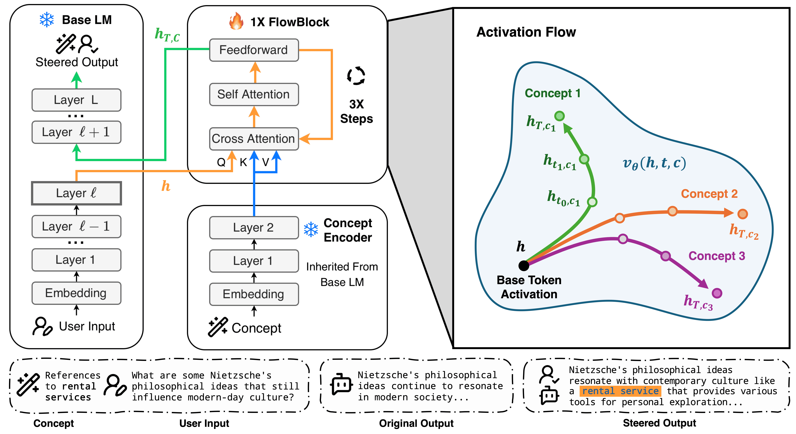
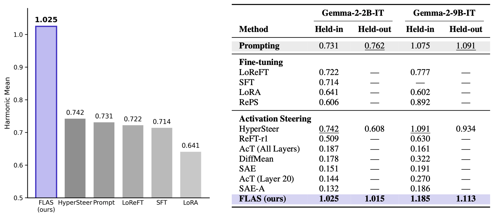

# FLAS

**Flow-based Activation Steering for Inference-Time Intervention.**

[](https://flas-ai.github.io)
[](https://arxiv.org/abs/2605.05892)
[](https://huggingface.co/flas-ai/flas-gemma-2-2b-it)
[](https://huggingface.co/flas-ai/flas-gemma-2-9b-it)
[](https://huggingface.co/spaces/Lunamos/flas-demo)

FLAS learns a concept-conditioned velocity field $v_\theta(h, t, c)$ that transports an unsteered activation $h$ to a steered activation $h'$ by integrating a flow ODE. The flow time $T$ serves as a continuous steering-strength parameter; sampling $T \sim \mathrm{Uniform}[T_{\min}, T_{\max}]$ during training enables zero-shot strength control at inference. FLAS is the first learned steering method to consistently outperform in-context prompting on AxBench.

<p align="center">
  
</p>

## How it works

FLAS learns a concept-conditioned velocity field $v_\theta(h, t, c)$ that transports an unsteered activation $h$ to a steered activation $h'$ by integrating a flow ODE:

$$h' = \varphi_T(h) = h + \int_0^T v_\theta\!\bigl(\varphi_t(h),\, t,\, c\bigr)\, dt$$

The flow time $T$ serves as a continuous steering-strength parameter; sampling $T \sim \mathrm{Uniform}[T_{\min}, T_{\max}]$ during training enables zero-shot strength control at inference. FLAS is the first learned steering method to consistently outperform in-context prompting on AxBench.

## Results

<p align="center">
  
</p>

Evaluated on AxBench's Concept16k held-in / held-out splits with Gemma-2-2B-IT and Gemma-2-9B-IT, intervening at layer 20, fixed $T = 2$. Generations are scored by GPT-4o-mini on Concept / Instruction-following / Fluency and aggregated into HMean. See the [paper](https://arxiv.org/abs/2605.05892) for full tables, baselines, and ablations.

## Get started

### Try it online

The hosted demo at <https://huggingface.co/spaces/Lunamos/flas-demo> runs Gemma-2-2B-IT with FLAS on a ZeroGPU slice. Type any concept (e.g. *"talk like a pirate"*) and a prompt, see the steered vs baseline output side-by-side.

### Pretrained checkpoints

Released on the Hugging Face Hub:

| Base model | Checkpoint repo | Inference VRAM peak |
|---|---|---:|
| Gemma-2-2B-IT | [`flas-ai/flas-gemma-2-2b-it`](https://huggingface.co/flas-ai/flas-gemma-2-2b-it) | **~5 GB** |
| Gemma-2-9B-IT | [`flas-ai/flas-gemma-2-9b-it`](https://huggingface.co/flas-ai/flas-gemma-2-9b-it) | **~18 GB**  |

Both are stored as bf16 `safetensors`.

### Run the app locally

The same Gradio UI that backs the hosted demo is bundled at `space/app.py`. Run it on your own GPU:

```bash
git clone https://github.com/flas-ai/FLAS && cd FLAS
uv sync                                # or: pip install -e .

uv run python space/app.py             # opens http://localhost:7860
```

On first launch the app downloads `flas-ai/flas-gemma-2-2b-it` from the Hub and caches it locally and afterwards it runs entirely offline. To expose the UI over a public link (e.g. when running on a remote / headless server), edit the last line of `space/app.py` to `demo.launch(share=True)`.

### CLI / interactive REPL

```bash
# After uv sync, pull a checkpoint locally
hf download flas-ai/flas-gemma-2-2b-it \
    --local-dir checkpoints/flas-gemma-2-2b-it

# Chat with steering
uv run python scripts/chat.py \
    --flow-ckpt checkpoints/flas-gemma-2-2b-it/flas-gemma-2-2b-it.safetensors \
    --flowtime 2.0 --n-steps 3
```

In the chat REPL, use `/concept <text>` to change the steering target and `/flowtime <T>` to change strength on the fly.

### Use in Python

```bash
pip install git+https://github.com/flas-ai/FLAS.git@main
```

```python
from huggingface_hub import hf_hub_download
from flas.generate import load_generator

ckpt = hf_hub_download("flas-ai/flas-gemma-2-2b-it", "flas-gemma-2-2b-it.safetensors")
hf_hub_download("flas-ai/flas-gemma-2-2b-it", "config.json")  # cached alongside

gen = load_generator(ckpt)
out = gen.generate_batch(
    prompts=["Tell me about your day."],
    concept_text="Talk like a pirate",
    flowtimes=[2.0], n_steps=3, max_tokens=128,
)
print(out[0]["generation"])
```

The base LLM (Gemma-2-2B-IT or Gemma-2-9B-IT) is downloaded from Hugging Face on first use; make sure you have run `hf auth login` and accepted the Gemma-2 license.

## Install (for development / training)

We recommend using [`uv`](https://docs.astral.sh/uv/):

```bash
uv sync
uv run python -c "import flas; print('ok')"
```

`uv` will read `pyproject.toml` and install a matching CUDA-enabled torch wheel automatically. 

If you prefer pip:

```bash
python -m venv .venv && source .venv/bin/activate
pip install -e .
```

The base LLM (Gemma-2-2B-IT or Gemma-2-9B-IT) is downloaded from Hugging Face. Make sure you have run `hf login` and accepted the Gemma-2 license.

## Data

FLAS trains on AxBench data. The AlpacaEval prompts used by `scripts/eval.py` are already bundled at `data/alpaca_eval.json` (sourced from [`tatsu-lab/alpaca_eval`](https://huggingface.co/datasets/tatsu-lab/alpaca_eval) — re-download yourself with `hf download tatsu-lab/alpaca_eval alpaca_eval.json --repo-type dataset --local-dir data` if needed). For training / Concept16k held-out eval, clone the AxBench repo:

```bash
git clone https://github.com/stanfordnlp/axbench thirdparty/axbench
```

Training data (Concept500 / Concept16k parquets) are tracked in the AxBench repo via Git LFS, so `git clone` already pulls them. They live at `thirdparty/axbench/axbench/<concept_set>/prod_<model>_<layer>_v1/generate/`.

For example, Concept500 on Gemma-2-2B-IT layer 20:

```
thirdparty/axbench/axbench/concept500/prod_2b_l20_v1/generate/
├── train_data.parquet
└── metadata.jsonl
```

## Hardware

End-to-end inference VRAM (peak, batch=1, 128-token generation, all bf16, with the ConceptEncoder sharing modules with the base LLM):

| Base model | Base (bf16) | FlowFunction | ConceptEncoder | **Inference peak** |
|---|---:|---:|---:|---:|
| Gemma-2-2B-IT | 4.9 GB | 0.2 GB | (shared) | **~5.1 GB** |
| Gemma-2-9B-IT | 17.2 GB | 0.5 GB | (shared) | **~17.8 GB** |

Batched eval (batch=15, 256 tokens) raises peaks to ~9 GB and ~22 GB respectively. Training peaks higher than inference because of optimizer state and activations — the recipes below were run on a single 80 GB A100, but a single 24 GB consumer card is plenty for the 2B Concept500 setting.

## Reproducing paper results

> **Note on dtype.** The checkpoints distributed on the Huggingface were converted from
> the original fp32 training artifacts to **bf16** to
> halve the VRAM/disk footprint. We re-evaluated bf16 on the AxBench Concept16k
> held-in / held-out splits at $T = 2$ and the GPT-4o-mini HMean fell within the
> 95% bootstrap confidence interval reported in the paper (Table 1). All
> recipes below run unchanged on either fp32 or bf16 weights.

Train on Concept500 (single 18 GB+ GPU, Gemma-2-2B-IT):

```bash
uv run python -m flas.train \
    --data-dir thirdparty/axbench/axbench/concept500/prod_2b_l20_v1/generate \
    --output-dir checkpoints --run-name flas_2b_c500
```

To train on Concept16k instead, add `--val-n-concepts` for training-time held-out evaluation:

```bash
uv run python -m flas.train \
    --data-dir thirdparty/axbench/axbench/concept16k/prod_2b_l20_v1/generate \
    --val-n-concepts 500 \
    --output-dir checkpoints --run-name flas_2b_c16k
```

Generate steered outputs:

```bash
uv run python scripts/eval.py \
    --flow-ckpt checkpoints/flas_2b_c500/best_step*.pt \
    --output-dir results/flas_2b_c500 \
    --num-eval-prompts 10 --max-tokens 256 \
    --flowtimes 1.0 1.5 2.0 2.5 3.0
```

Score generations with GPT-4o-mini (AxBench-aligned C/I/F judge):

```bash
uv run python scripts/judge_openai.py \
    --results-file results/flas_2b_c500/results_shard0.json \
    --output       results/flas_2b_c500/judged.json \
    --api-key "$OPENAI_API_KEY" --concurrency 8
```

Interactive CLI for testing:

```bash
uv run python scripts/chat.py \
    --flow-ckpt checkpoints/flas_2b_c500/best_step*.pt
```

## Evaluation protocol

Following AxBench (Wu et al., 2025):

1. **Generate.** For each held-out concept × AlpacaEval prompt × flowtime $T$, generate steered text with `scripts/eval.py`.
2. **Judge.** GPT-4o-mini scores each generation on Concept ($C$), Instruction-following ($I$), and Fluency ($F$), each in $\{0, 1, 2\}$.
3. **Aggregate.** Per-factor max with prompt-level 50/50 split: pick the best $T$ per concept on "train" prompts, report HMean = $3 / (1/C + 1/I + 1/F)$ on "test" prompts.

## Project layout

```
flas/
├── src/flas/
│   ├── model.py          # FlowBlock
│   ├── train.py          # PyTorch Lightning training
│   ├── generate.py       # Batched generation
├── scripts/
│   ├── eval.py           # AxBench-aligned generation
│   ├── judge_openai.py   # GPT-4o-mini judge
│   └── chat.py           # interactive CLI
├── pyproject.toml
├── LICENSE
└── README.md
```

## Acknowledgements and data

- **Base models** — [Gemma-2-2B-IT](https://huggingface.co/google/gemma-2-2b-it) and [Gemma-2-9B-IT](https://huggingface.co/google/gemma-2-9b-it) (Google).
- **Steering data and evaluation pipeline** — [AxBench](https://github.com/stanfordnlp/axbench) (Wu et al., 2025): Concept500 / Concept16k corpora and the C/I/F judge prompts.
- **Eval prompts** — [AlpacaEval](https://github.com/tatsu-lab/alpaca_eval) (Li et al., 2023): the 805 instructions used at evaluation time. The bundled `data/alpaca_eval.json` is a verbatim copy of [`tatsu-lab/alpaca_eval`](https://huggingface.co/datasets/tatsu-lab/alpaca_eval).

## Citation

```bibtex
@article{flas2026,
  title  = {Beyond Steering Vector: Flow-based Activation Steering for Inference-Time Intervention},
  author = {Zehao Jin and Ruixuan Deng and Junran Wang and Xinjie Shen and Chao Zhang},
  year   = {2026},
  eprint = {2605.05892},
  archivePrefix = {arXiv},
  primaryClass = {cs.CL},
  url    = {https://arxiv.org/abs/2605.05892},
}
```

## License

Released under the Apache 2.0 (see [LICENSE](LICENSE)).
